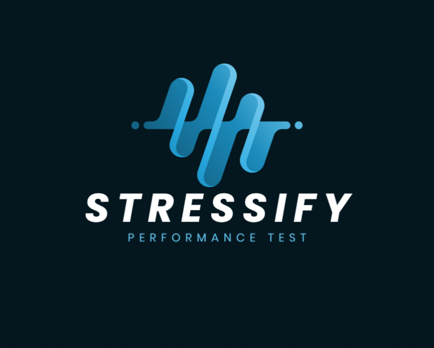

<div align="center">
  
</div>

| Code Coverage | Documentation |
|---------------|---------------|
| [](https://codecov.io/github/jfilhoGN/StressifyPerformanceTest) | [](https://stressifyjl.readthedocs.io/en/latest/) |


# Stressify Performance Test

**Stressify Performance Test** is a performance testing tool written in Julia, inspired by tools like K6. Its primary focus is on collecting, analyzing, and generating customizable metrics to help developers gain deeper insights into the performance of APIs under various load conditions. With Stressify, you can easily track performance indicators and extend the tool to create new metrics tailored to your needs.

## 🚀 Features

- **Highly Configurable**: Adjust virtual users (VUs), ramp-up phases, iterations, and durations to suit your needs.
- **Multiple HTTP Methods**: Supports GET, POST, PUT, PATCH, and DELETE requests.
- **Custom Checks**: Validate API responses with user-defined conditions for flexible testing.
- **Detailed Metrics**: Includes success rates, error rates, percentile response times (P90, P95, P99), RPS, and TPS.
- **Real-Time Dashboard**: Monitor test execution and metrics in a live dashboard.

---

## 📦 Installation

### Prerequisites

Ensure you have [Julia](https://julialang.org/downloads/) installed on your system.

### Steps

1. Clone this repository:
   ```bash
   git clone https://github.com/jfilhoGN/StressifyPerformanceTest.git
   cd StressifyPerformanceTest
   ```
2. Install required dependencies:
   ```julia
   using Pkg
   Pkg.instantiate()
   ```

---

## 🛠 Usage

### Example Test Script

Here's an example demonstrating how to use **Stressify** for performance testing:

```julia
using Stressify

# Configure test options
Stressify.options(
    vus = 5,                     # Number of Virtual Users
    format = "vus-ramping",      # Ramp-up mode
    ramp_duration = 10.0,        # Ramp-up duration (seconds)
    max_vus = 15,                # Maximum Virtual Users
    duration = 60.0              # Test duration (seconds)
)

# Run the test
results = Stressify.run_test(
    Stressify.http_get("https://httpbin.org/get")  # Target API endpoint
)
```

---

## 📊 Metrics

After a test completes, you'll get detailed performance metrics, including:

- **Iterations**: Total number of requests executed.
- **Success Rate**: Percentage of successful requests.
- **Error Rate**: Percentage of failed requests.
- **Response Times**: Min, Max, Mean, Median, P90, P95, P99.
- **RPS**: Requests per second.
- **TPS**: Transactions per second.

These results are available in the terminal.

---

## 🤝 Contributing

Contributions are welcome! To get started:

1. Fork this repository.
2. Create a new branch for your feature or bug fix:
   ```bash
   git checkout -b feature-name
   ```
3. Make your changes and test them.
4. Commit your changes:
   ```bash
   git commit -m "Description of your changes"
   ```
5. Push the branch and create a pull request.

For major changes, please open an issue first to discuss your proposal.

---

## 📝 License

This project is licensed under the MIT License.

---

Happy Testing! 🚀
